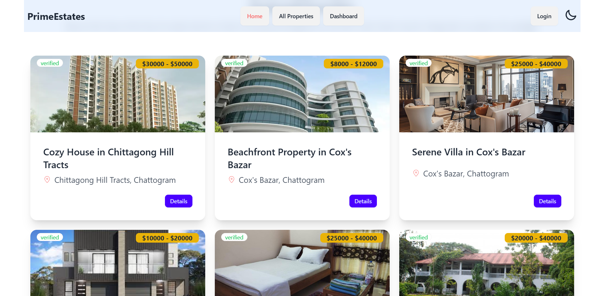

# Prime Estates



# Live Link

- https://nafis-prime-estates.netlify.app/

###

- admin username : admin1@gmail.com
- admin password : 123456aA

# Purpose

- In this website, users can register using their email and password, also they can use their google credentials for seamless login experience. There are three roles (Admin, Buyers and Sellers). Admin can manage properties (verify, delete), manage users etc. Buyers can add any property to their wishlist and bid their prices. They can also post reviews on properties. Sellers can add properties which need to be verified by the admins first and then they can be sold. Sellers can also update the properties. If a bid is successful, the buyer can pay through Stripe and buy the property.

## Features

- **Users** can:
  - Browse properties and place bids
  - Wishlist properties for later viewing
  - Leave reviews on purchased properties
- **Sellers** can:
  - Add new property listings
  - Update property details
- **Admins** can:
  - Verify users, sellers, and properties
  - Take administrative actions to ensure smooth platform operation

## Tech Stack

- **Frontend:** React, Tailwind CSS, DaisyUI
- **Backend:** Node.js, Express, MongoDB
- **Authentication:** Firebase Authentication
- **Payments:** Stripe
- **State Management:** React Query
- **API Requests:** Axios

## Dependencies

### Main Dependencies

```json
{
  "@emotion/react": "^11.13.5",
  "@headlessui/react": "^2.2.0",
  "@stripe/react-stripe-js": "^3.1.1",
  "@stripe/stripe-js": "^5.5.0",
  "@tanstack/react-query": "^5.64.1",
  "axios": "^1.7.9",
  "date-fns": "^4.1.0",
  "firebase": "^11.1.0",
  "lottie-react": "^2.4.0",
  "prop-types": "^15.8.1",
  "react": "^18.3.1",
  "react-awesome-reveal": "^4.2.14",
  "react-dom": "^18.3.1",
  "react-fast-marquee": "^1.6.5",
  "react-icons": "^5.4.0",
  "react-rating-stars-component": "^2.2.0",
  "react-responsive-carousel": "^3.2.23",
  "react-router-dom": "^7.1.1",
  "react-toastify": "^10.0.6",
  "sweetalert2": "^11.14.5",
  "swiper": "^11.1.15"
}
```

### Dev Dependencies

```json
{
  "@eslint/js": "^9.17.0",
  "@types/react": "^18.3.18",
  "@types/react-dom": "^18.3.5",
  "@vitejs/plugin-react": "^4.3.4",
  "autoprefixer": "^10.4.20",
  "daisyui": "^4.12.23",
  "eslint": "^9.17.0",
  "eslint-plugin-react": "^7.37.2",
  "eslint-plugin-react-hooks": "^5.0.0",
  "eslint-plugin-react-refresh": "^0.4.16",
  "globals": "^15.14.0",
  "postcss": "^8.4.49",
  "tailwindcss": "^3.4.17",
  "vite": "^6.0.5"
}
```

## Environment Variables

To run this project, you need to set up the following environment variables in a `.env` file:

```
VITE_apiKey=YOUR_FIREBASE_API_KEY
VITE_authDomain=YOUR_FIREBASE_AUTH_DOMAIN
VITE_projectId=YOUR_FIREBASE_PROJECT_ID
VITE_storageBucket=YOUR_FIREBASE_STORAGE_BUCKET
VITE_messagingSenderId=YOUR_FIREBASE_MESSAGING_SENDER_ID
VITE_appId=YOUR_FIREBASE_APP_ID
VITE_IMGBB_API_KEY=YOUR_IMGBB_API_KEY
VITE_STRIPE_PK=YOUR_STRIPE_PUBLIC_KEY
VITE_SERVER_ADDRESS=YOUR_SERVER_URL
```

**Backend Environment Variables:**

```
DB_USER=YOUR_DATABASE_USERNAME
DB_PASS=YOUR_DATABASE_PASSWORD
ACCESS_TOKEN_SECRET=YOUR_ACCESS_TOKEN_SECRET
STRIPE_SK=YOUR_STRIPE_SECRET_KEY
```

> ⚠ **Important:** Do not expose your environment variables publicly.

## Installation

1. **Clone the repository:**
   ```sh
   git clone https://github.com/NafisUlAlam/Prime-Estates.git
   cd Prime-Estates
   ```
2. **Install dependencies:**
   ```sh
   npm install
   ```
3. **Set up environment variables:**
   - Create a `.env` file in the root directory and add the required variables.
4. **Start the development server:**
   ```sh
   npm run dev
   ```

## Usage

- Access the platform at `http://localhost:5173`
- Use the provided authentication methods to log in
- Explore property listings, bid, and manage properties

## Contributing

Contributions are welcome! Feel free to submit issues or pull requests.

## License

This project is licensed under the MIT License.
